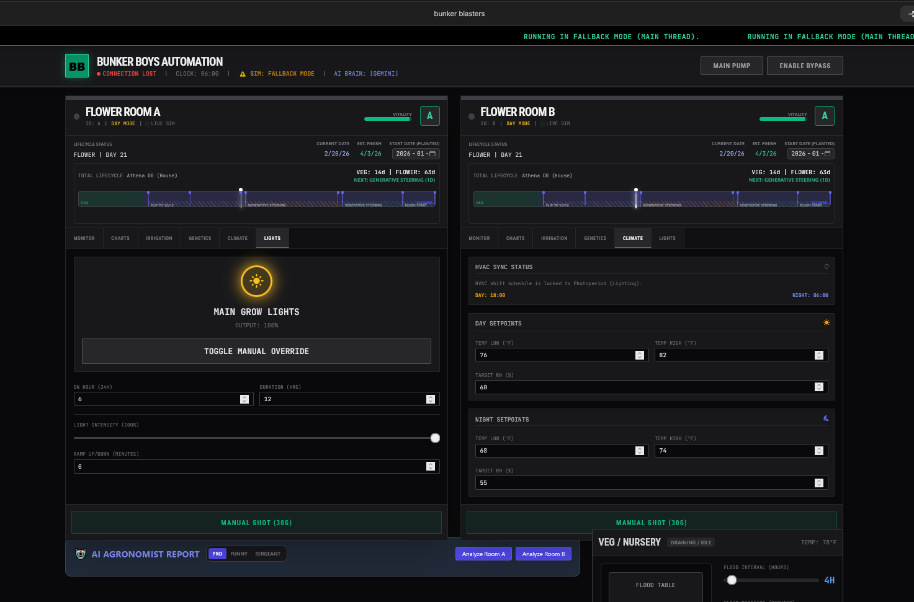
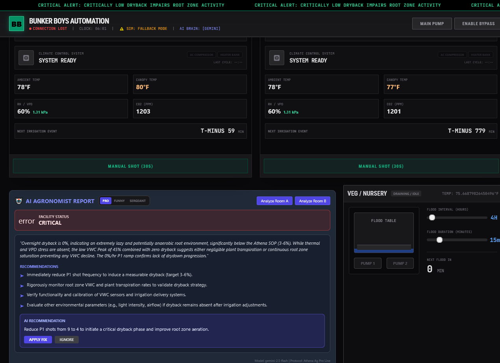
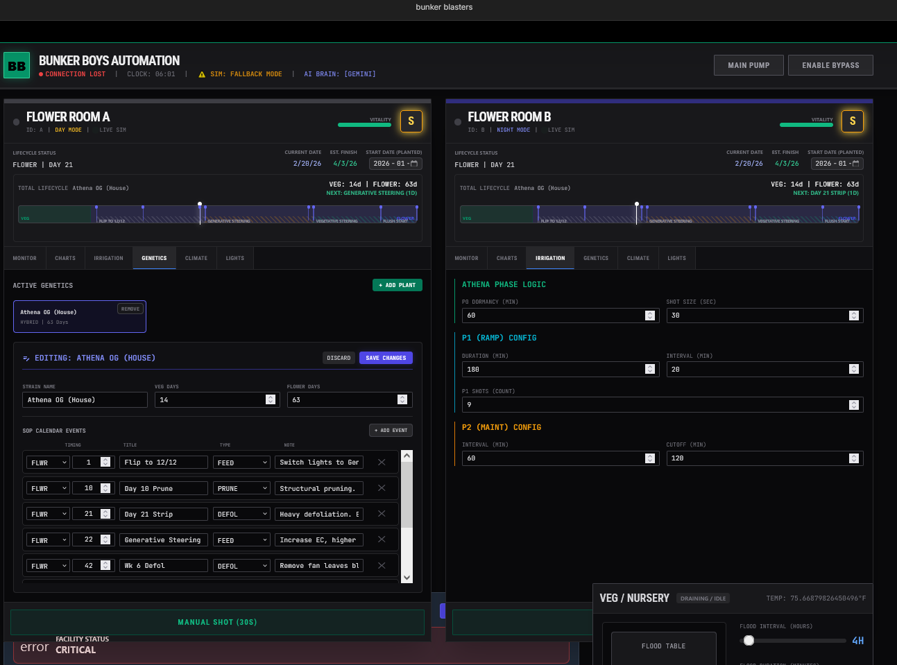

# 🏭 Bunker Boys Automation: Precision CEA Digital Twin

**Version:** 2.4.0 (Tranquil Pulse Update)
**Stack:** Angular 18+ (Zoneless), Web Workers, Signals, D3.js, Tailwind CSS
**AI Engines:** Google Gemini 2.5 Flash (Default/Cloud) + Ollama/Llama3 (Local Fallback)

---
<h2>Screenshots</h2>


<br><br>

<br><br>

## 🛠️ Engineering Executive Summary

### Distributed Hardware Topology (The Reality)
The system operates on a **5-Node Distributed Mesh** to ensure high availability and concern separation. The Angular Dashboard ("The Brain") aggregates telemetry from these dedicated edge nodes:

1.  **Node 1: Fertigation Hub (ESP32)**
    *   **Role:** Critical Actuation.
    *   **Peripherals:** 4-Channel Relay (Pump, Recirc, Room A Solenoid, Room B Solenoid).
    *   **Safety:** Hard-wired Ultrasonic Reservoir Sensor. If level < 5%, pump power is physically cut.

2.  **Node 2 & 3: Environment Hubs (ESP32 x2)**
    *   **Role:** Climate Control (A/B).
    *   **Peripherals:** 24V HVAC Contactor (Cool/Heat), 12/12 Lighting Contactor.
    *   **Logic:** Independent fail-safe thermostats.

3.  **Node 4 & 5: Telemetry Hubs (ESP32 x2)**
    *   **Role:** Precision Sensing.
    *   **Sensors:** TEROS 12 (VWC/EC/Temp) via SDI-12, SCD40 (CO2), MLX90614 (Canopy IR Temp).

4.  **Command Center**
    *   **Gateway:** Raspberry Pi 4 (Home Assistant Supervisor).
    *   **AI Server:** ThinkCentre M710e (NVIDIA GPU) running Ollama/Llama3 via Cloudflare Tunnel.
    *   **HMI:** Angular Dashboard on Operator Terminals.

---

## 🧠 Simulation & Physics Engine

### "God Mode" Integrity
The system includes a Web Worker-based Digital Twin that runs in parallel with real hardware.
*   **Sub-Step Physics:** The engine calculates plant metabolism and hydrology in **6-second ticks** (0.1m). This ensures that short irrigation pulses (30s) are never "skipped", even when Time Dilation is set to **1000x**.
*   **Ultrasonic Interlock:** The simulation enforces the same physical constraints as Node 1. If `reservoirLevel < 5%`, the virtual `valveOpen` state is mechanically blocked.

### AI Agronomist (Dual-Brain)
*   **Cloud (Gemini 2.5):** Processes complex Crop Steering trends (Dryback %, EC Stacking).
*   **Local (Ollama):** Air-gapped fallback running on the local GPU server.

---

## 🎮 Operational Modes

### 1. Single-Zone Testing
Currently, the facility is in a commissioning phase.
*   **Pump Logic:** The Main Pump (Relay 1) can be fired manually for recirculation/testing even if Room Solenoids are logically bypassed.
*   **Safety:** Software interlocks are lifted when `BYPASS_MODE` is active to allow line flushing.

### 2. Crop Steering Phases
Automated irrigation adheres to the Athena Pro Line generative stacking method:
*   **P0:** Post-sunrise dormancy (0-60min).
*   **P1:** Saturation ramp (multiple shots to Field Capacity).
*   **P2:** Maintenance (micro-shots to hold VWC).
*   **P3:** Overnight dryback (generative stress).

---

## 🚀 Installation & Setup

1.  **Environment:**
    ```bash
    export API_KEY="your_gemini_key"
    export OLLAMA_ORIGINS="*"
    ```
2.  **Run Dashboard:**
    ```bash
    npm install
    npm start
    ```
3.  **Verify Nodes:**
    Check `src/services/facility.service.ts` to ensure HA Entity IDs match your ESPHome YAML configuration.
